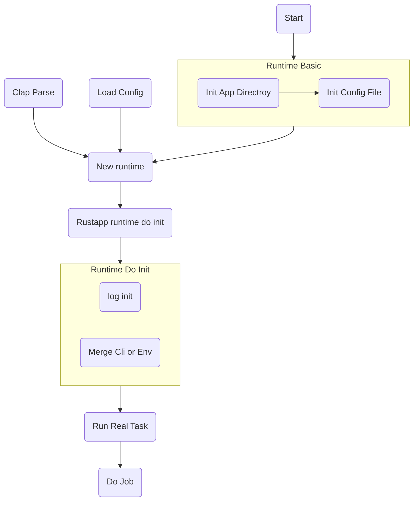

# rustapp_template

这是一个 rustapp 开发基础框架，集合了常见的功能，为后期 **rustweb3** 应用开发的基础框架。

[Create repo with this template](https://github.com/new?template_name=rustapp_template&template_owner=rustweb3)

功能模块说明如下:

1. *src/config.rs* 中定义 **APP_NAME** 定义应用名称,运行过程中会创建应用文件夹,应用文件夹: ~/.config/${APP_NAME}
2. 默认配置文件路径: ~/.config/${APP_NAME}/config/config.toml, 可以在运行过程中，使用 -c 或者 --config 加载
3. 配置文件映射定义在 *src/config.rs* 中的 **MyConfig**
4. 命令行应用使用 clap 定义，映射在 src/cli.rs
5. hooks 定义, 考虑后期扩展定义 hooks 函数模块，定义在 src/hooks.rs 中，应用中可以通过 runtime.hooks.run_hooks 触发
6. jobs 分离定义，接受 Runtime 的引用，根据cli 中定义的 Command 调用 job
7. 定义一个线程安全的上下文对象，可供并发控制共享 数据定义在 src/app.rs 中的 **Context** 定义。

应用执行流程图:

